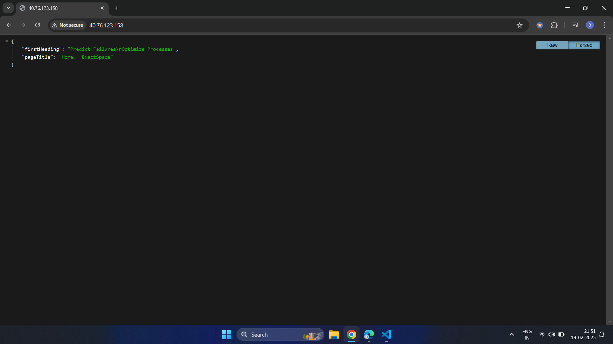

# Web Scraper

This application:
- Scrapes a user-specified URL using Node.js and Puppeteer.
- Hosts the scraped content using Python Flask.

## Prerequisites
- Docker installed on your system.

## Building the Docker Image
- Use the below command if you dont want to override the SCRAPE_URL specified in Dockerfile
```sh
docker build -t web-scrape-image:v1.0 .       
```
## Passing the SCRAPE_URL as argument
- Below command is useful when you to override the SCARPE_URL specified in Dockerfile
```sh
docker build --build-arg SCRAPE_URL=https://exactspace.co -t web-scrape-image:v1.0 .
```

## Running the Docker Image
```sh
docker run -d -p 80:5000 web-scrape-image:v1.0
```

## Access the hosted data
- Open your browser and navigate to http://localhost.
- If running in Virtual Machine goto http://<{VMPublicIP}>

## Output
- Below image is the expected output when accessed form browser




## miscellaneous
- The above application can be build and run with docker-compose commands
```sh
docker-compose up -d
```
- Above app is tested by deploying as pod
```sh
kubectl apply -f k8s-manifest/
```

